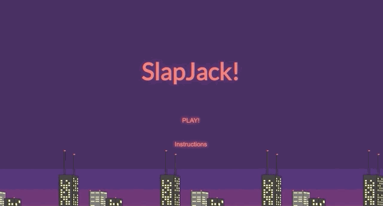
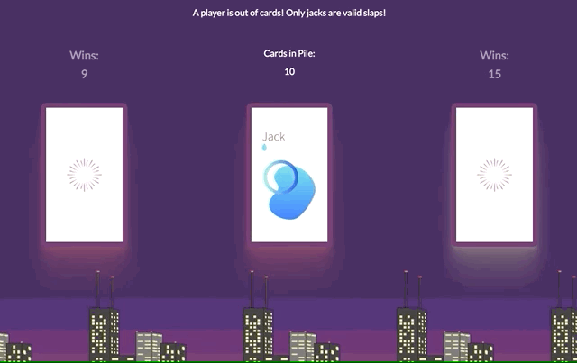

# SlapJack

## Abstract  
Create a web-based game emulating the card game 'SlapJack'. Emphasis was placed on contributors use and understanding of DRY (Don't Repeat Yourself) Coding, localStorage, and event delegation. It was expected of contributors to avoid copying code, refer only to learning/reference sites (MDN, CSS-Tricks, etc.), and keep peer to peer conversation about general ideas rather than literal code.  

This site is a fully functional version of the game 'SlapJack'. User Additions on top of base gameplay functionality are a Start Menu and Instructions, along with all styling outside of card images (which were provided). The strict functionality of the game runs on a single event listener and two querySelectors, with quality of life improvements adding more of each. Only one global variable is present, being the game instance. The final version supports Win and Central Card Pile counters, with Wins being persistent on refresh, a UI improvement to show various game happenings, and minor CSS improvements. Thought and care were used to ensure all aspects of the site mesh from a visual standpoint. All colors used in the game/fonts were also used in the background creation to ensure all aspects tie together.  

## Contributors ##

* [Connor Anderson-Larson](https://github.com/ConnorAndersonLarson)

## Languages Used ##

* JavaScript
* HTML
* CSS

### Resources Used  

* MDN
* CSS-Tricks

## Opening the Program  
Clone the repo to your terminal and open index.html in your browser. Read the instructions (under instructions) before starting a new game to ensure familiarity with controls.  

## Project Details  
Start Menu and Hover states  
  

Instruction Menu  
  

__Game Functionality__
SlapJack   
[SlapJack](/.github/README/Card Count and SlapJack.gif)  

Doubles  
[Doubles Slap](/.github/README/Double Slap.gif)  

Sandwich  
[Sandwich Slap](/.github/README/Sandwich Slap.gif)  

__Endgame Functionality__
Notification  
[Notification](/.github/README/EndGame Notification.gif)  

Reshuffle  
[Reshuffle](/.github/README/EndGame Reshuffle.gif)  

Return to Normal  
  

Winning  
[Winning the Game](./.github/README/Winning Game.gif)  

New Game  
  

Persistent Wins  
  
